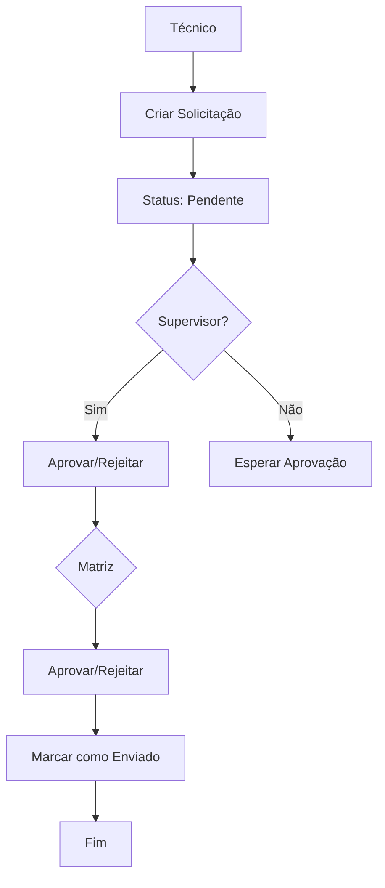
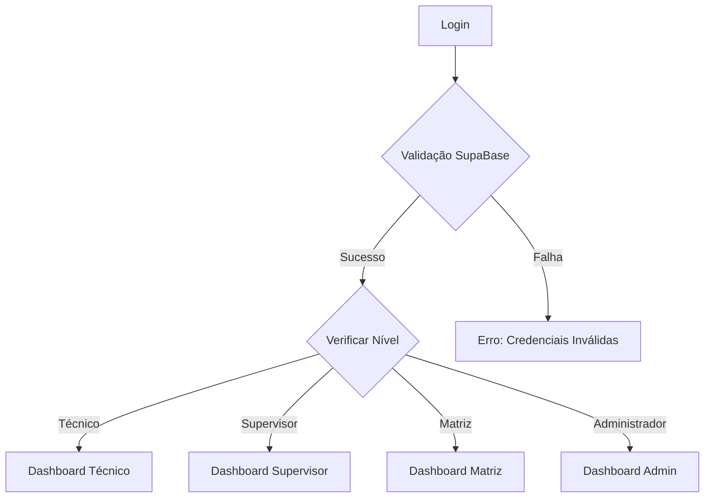

# Arquitetura do Sistema de Solicitação de Peças

## Visão Geral

O Sistema de Solicitação de Peças é uma aplicação web desenvolvida com tecnologias front-end puras (HTML5, CSS3, JavaScript ES6+) e SupaBase como backend. O sistema implementa uma arquitetura cliente-servidor com persistência de dados em nuvem.

## Arquitetura Geral

```
┌─────────────────┐    ┌─────────────────┐    ┌─────────────────┐
│   Navegador     │    │   SupaBase      │    │   Banco de      │
│   (Cliente)     │◄──►│   (Backend)     │◄──►│   Dados         │
│                 │    │                 │    │                 │
│ • HTML/CSS/JS   │    │ • API REST      │    │ • PostgreSQL    │
│ • localStorage  │    │ • Autenticação  │    │ • Row Level     │
│ • Chart.js      │    │ • Real-time     │    │   Security      │
│ • jsPDF         │    │ • Storage       │    │                 │
└─────────────────┘    └─────────────────┘    └─────────────────┘
```

## Estrutura de Arquivos

```
sistema-solicitacao-pecas/
├── index.html              # Página de login
├── logo.png               # Logo da empresa
├── README.md              # Documentação principal
├── TODO.md                # Lista de tarefas
├── ARCHITECTURE.md        # Este arquivo
├── css/                   # Estilos CSS
│   ├── style.css          # Estilos globais
│   ├── dashboard.css      # Estilos do dashboard
│   ├── detalhes_solicitacao.css
│   ├── mobile-responsive.css
│   └── [outros].css
├── js/                    # Scripts JavaScript
│   ├── app.js             # Lógica principal e navegação
│   ├── config.js          # Configuração SupaBase
│   ├── dashboard.js       # Lógica do dashboard
│   ├── detalhes_solicitacao.js
│   ├── utils.js           # Funções utilitárias
│   └── [outros].js
└── pages/                 # Páginas da aplicação
    ├── dashboard.html
    ├── detalhes_solicitacao.html
    └── [outras].html
```

## Componentes Principais

### 1. Autenticação e Autorização

- **Login**: Autenticação via SupaBase Auth
- **Níveis de Usuário**:
  - **Técnico**: Cria solicitações, visualiza próprias solicitações
  - **Supervisor**: Aprova solicitações de técnicos sob sua supervisão
  - **Matriz**: Aprova solicitações, marca como enviadas
  - **Administrador**: Acesso total + cadastros de usuários/peças/veículos

### 2. Módulos do Sistema

#### Dashboard
- **Responsabilidades**:
  - Exibir métricas por nível de usuário
  - Gráficos de status e atividade
  - Filtros por data e tipo de informação
- **Tecnologias**: Chart.js para gráficos

#### Solicitações
- **Criação**: Formulário dinâmico com grid de itens
- **Aprovação**: Workflow supervisor → matriz
- **Estados**: Pendente → Aprovado/Rejeitado → Enviado

#### Cadastros (Administrador)
- **Usuários**: CRUD completo
- **Peças**: Catálogo de peças disponíveis
- **Veículos**: Placas e equipes associadas

### 3. Estrutura do Banco de Dados

#### Tabelas Principais

```sql
-- Usuários do sistema
usuarios (
    id: uuid (PK)
    nome: text
    nomecompleto: text
    email: text (unique)
    senha: text (hashed)
    nivel: enum('tecnico', 'supervisor', 'matriz', 'administrador')
    placa: text (FK → veiculos.placa)
    created_at: timestamp
    updated_at: timestamp
)

-- Veículos e equipes
veiculos (
    id: uuid (PK)
    placa: text (unique)
    qtd_equipe: integer
    supervisor_id: uuid (FK → usuarios.id)
    tecnico_id: uuid (FK → usuarios.id)
    created_at: timestamp
)

-- Catálogo de peças
pecas (
    id: uuid (PK)
    codigo: text (unique)
    nome: text
    descricao: text
    created_at: timestamp
)

-- Solicitações de peças
solicitacoes (
    id: uuid (PK)
    usuario_id: uuid (FK → usuarios.id)
    veiculo_id: uuid (FK → veiculos.id)
    status: enum('pendente', 'aprovado', 'rejeitado', 'enviado')
    rota: text
    itens: jsonb (array de {codigo, nome, quantidade})
    created_at: timestamp
    updated_at: timestamp
    data_aprovacao: timestamp (nullable)
)
```

#### Relacionamentos

```
usuarios (n) ──── (1) veiculos (supervisor_id)
usuarios (n) ──── (1) veiculos (tecnico_id)
usuarios (1) ──── (n) solicitacoes
veiculos (1) ──── (n) solicitacoes
```

## Fluxos de Usuário

### Fluxo de Solicitação



### Fluxo de Autenticação



## Padrões de Desenvolvimento

### JavaScript
- **ES6+**: Arrow functions, template literals, destructuring
- **Modular**: Funções separadas por responsabilidade
- **Comentários**: Em português brasileiro
- **Event Listeners**: Adicionados via addEventListener
- **DOM Manipulation**: querySelector e manipulação direta

### CSS
- **Mobile-First**: Responsividade priorizada
- **BEM-like**: Classes descritivas
- **Variáveis CSS**: Para cores e espaçamentos consistentes
- **Flexbox/Grid**: Layouts modernos

### Segurança
- **Row Level Security (RLS)**: Políticas no SupaBase
- **Autenticação**: Via SupaBase Auth
- **Validação**: Client-side + server-side
- **HTTPS**: Comunicação encriptada

## Dependências Externas

### Bibliotecas JavaScript
- **@supabase/supabase-js@2**: Cliente SupaBase
- **chart.js**: Gráficos no dashboard
- **jspdf**: Geração de PDFs

### CDN
- Todas as bibliotecas carregadas via CDN para simplicidade
- jsPDF plugins incluídos separadamente

## Considerações de Performance

### Otimização Frontend
- **Lazy Loading**: Scripts carregados apenas quando necessários
- **Minificação**: CSS e JS minificados em produção
- **Cache**: Headers apropriados para assets estáticos

### Otimização Backend
- **Índices**: Nas consultas frequentes do SupaBase
- **Paginação**: Para listagens grandes
- **Real-time**: Apenas onde necessário

## Monitoramento e Logs

### Logs do Cliente
- Console logs para debugging
- Tratamento de erros com try/catch
- Feedback visual para usuário

### Logs do Servidor
- SupaBase logs de queries
- Monitoramento de performance
- Alertas de erro

## Próximos Passos

### Melhorias Planejadas
1. **PWA**: Service workers para offline
2. **Testes**: Unitários e E2E
3. **CI/CD**: Pipeline de deploy automático
4. **Microserviços**: Separação de responsabilidades
5. **API Gateway**: Camada de abstração

### Escalabilidade
- **Cache**: Redis para sessões
- **CDN**: Para assets estáticos
- **Load Balancer**: Para múltiplas instâncias
- **Database Sharding**: Para grande volume de dados
